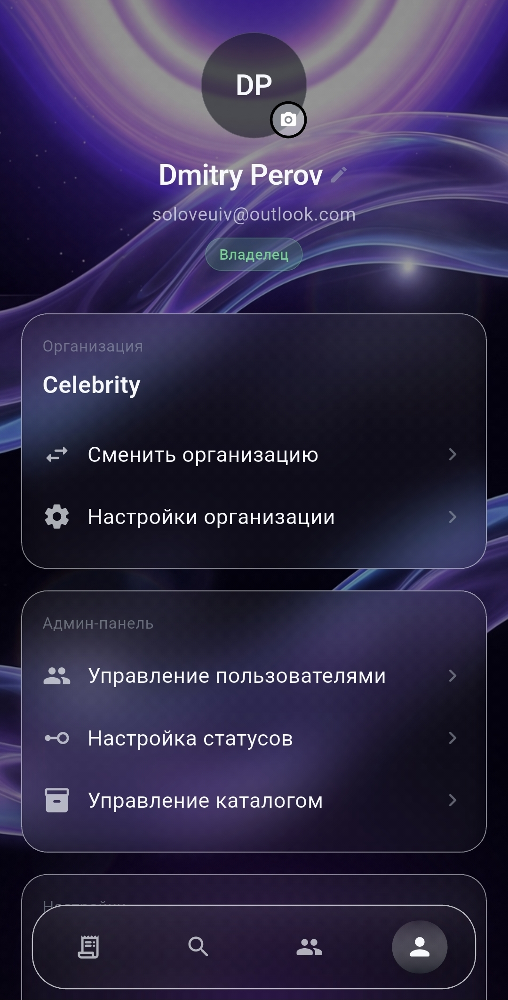
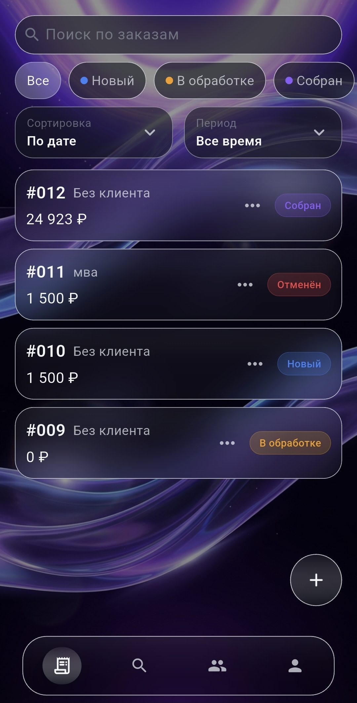
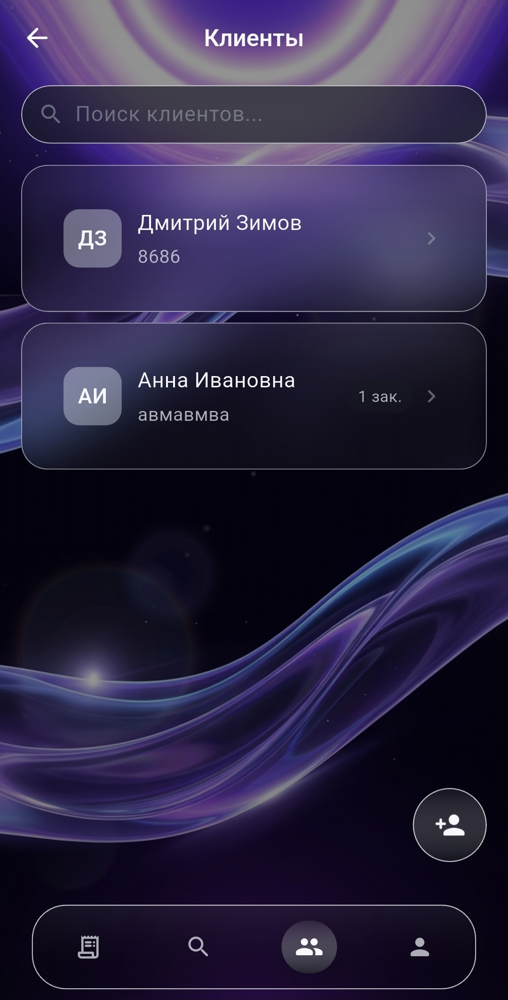
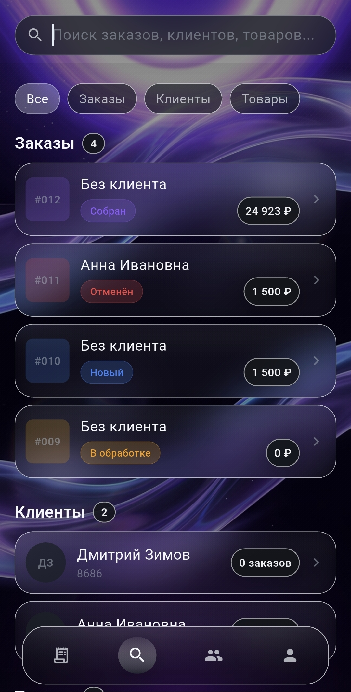

# Deskflow

> Мобильная CRM для e-commerce команд с контекстным чатом внутри каждого заказа.

Deskflow объединяет заказы, клиентов, каталог товаров, уведомления и рабочие обсуждения в одном Flutter-приложении. Проект построен вокруг multi-org модели на Supabase с RLS-изоляцией, ролями `Owner / Admin / Member` и интерфейсом в стиле Liquid Glass.

## Стек

- Flutter 3 + Dart 3.10
- Riverpod, Flutter Hooks, GoRouter
- Supabase Auth, PostgreSQL, Realtime, Storage, Edge Functions
- SharedPreferences, logger, intl, image_picker, file_picker

## Скриншоты

### Основной экран

### Заказы и детали

### CRM-поток

### Дополнительный сценарий

